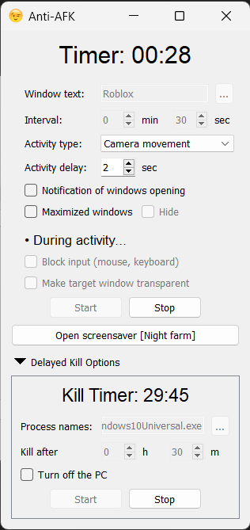

# Anti-AFK GUI

Anti-AFK GUI is a program designed to bypass kicks from the server due to inactivity. It is universal and contains various settings. And most importantly, it works in the background! You don't have to keep your game open all the time.

# How to use

1. Specify the `Window text` field and configure other settings.
2. Minimize windows with the specified titles.
3. Press the `Start` button.

To reset AFK timers in maximized windows as well, activate the `Maximized windows` checkbox.

> [!TIP]
> If the target game allows you to run multiple instances, then you can simultaneously play on the main account and grind in minimized windows using alts, resetting their AFK timers.

# How it works

* Anti-AFK identifies all windows matching the `Window text`.
* Input is blocked, and the target windows becomes transparent (if the appropriate settings are enabled).
* The windows are briefly brought to the foreground.
* Keystrokes are sent to reset any potential AFK timers.
* This repeats every `Interval`.

> [!IMPORTANT]
> When the window opens, stop clicking the mouse and pressing keys, otherwise you will interfere with Anti-AFK. After window automatically minimizes, you can continue your work.

# Preview

## Settings:
| Setting name | Purpose | 
|------------|------------|
| `Window text` | Target window titles | 
| `Interval` | AFK timer reset interval | 
| `Activity type` | Pre-built activity scenarios | 
| `Activity delay` | Delay between target window opening and activity | 

* You can determine the window title by hovering over the game window or checking in the task manager.
* `Window text` and `Process names` can be entered separately by commas in the field or in the list entry window using the `...` button.
* During activity, keys will be randomly held for a duration ranging from 300 to 600 ms.
* After opening the `Screensaver`, it will automatically close upon mouse movement.
* If you have activated `Turn off the PC` in the `Delayed Kill Options`, the shutdown will occur only after 5 minutes following the termination of the specified processes, allowing you time to cancel it.

> [!WARNING]
> `Turn off the PC` function forcefully terminates the computer. All unsaved data will be lost.

#### Possible problems:
* If the activity triggers before the window is fully loaded, try increasing the `Activity delay`.
* In the case of unexpected exceptions, input block is automatically disabled (if it was enabled in the settings). However, if for some reason this doesn't work, use the Control-Alt-Delete key combination to access the task manager and terminate the program from there.

# Bannable?
Make sure that using macros is allowed in your game.

Remember, however, that each player is responsible for the actions on his account. If you choose to use Anti-AFK, it is your responsibility if you get banned for using it. I do not take any responsibility for any damage caused.

# TODO

- [ ] Overriding settings: add the ability to create individual settings for each application.
- [ ] Add the ability to create and edit activity scenarios (`Activity types`) in the graphical interface.

> Made with ♥️ by JunkBeat
